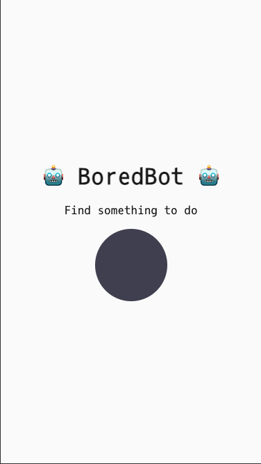
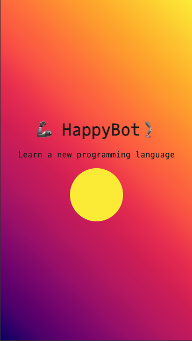

# 🤖 BoredBot

Simple HTML/CSS/JS app that uses the [Bored API](https://apis.scrimba.com/bored/documentation) to suggest fun things to do when you’re bored.

## Demo

🌐 [Live site on Netlify](https://aninboredbot.netlify.app/)

## Features

- Fetches random activities using the Bored API
- Simple and responsive design
- Installable as a PWA (Add to Home Screen)

## Tech

Built with:

- HTML
- CSS
- JavaScript (fetch)

## 🚀 Performance

Optimized for maximum efficiency, scoring a perfect **100** in all Lighthouse categories (Performance, Accessibility, Best Practices, and SEO).

## 📸 Screenshot

  
  

